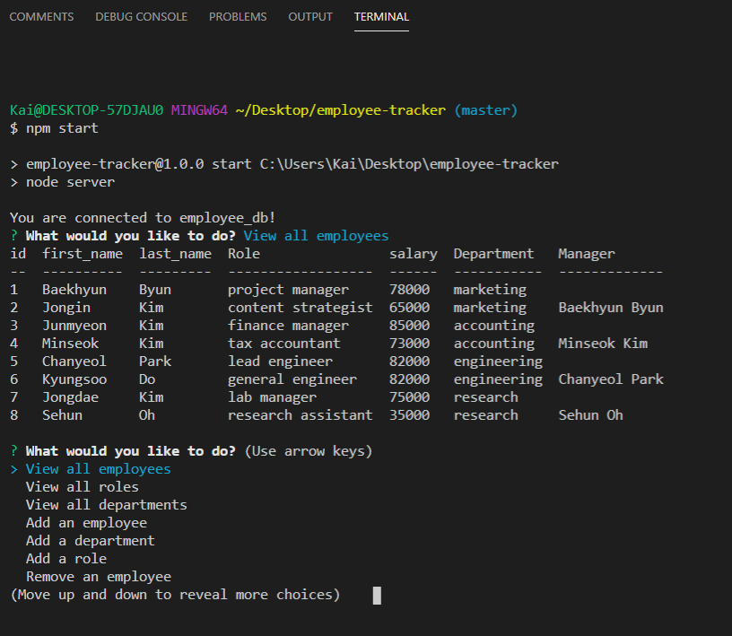

# Employee Tracker
 

## Description & Deployment
This app enables a user to keep track of their employee roster. Inside the app, the user can answer prompts in the terminal to view, add, or delete employees, departments, and roles within their business.

[VIEW A DEMONSTRATION OF THE DEPLOYED APP HERE.](https://youtu.be/W9BG2phrewE) 

---

## Table of Contents
1. [Installation](#Installation)
2. [Usage](#Usage)
3. [License](#license)
4. [Contributing](#Contributing)
5. [Future Development](#Future-Development)
6. [Questions](#Questions)
---

## Installation
1. Download the code from [this app's Github repo](https://github.com/kairora/employee-tracker)
2. Ensure VS Code and the terminal can be used 
3. Install the inquirer, mysql, and console.table npm packages 

## Usage
The user must ensure that all above packages are installed. After installation, the user can run the code below in the command line.
~~~JS 
npm start 
~~~ 
 The user will then be prompted to choose an action, either deleting, viewing, or adding data to the roster. 

---

## License
### ISC License
Copyright (c) 2020 Brianna Bullock

Permission to use, copy, modify, and/or distribute this software for any purpose with or without fee is hereby granted, provided that the above copyright notice and this permission notice appear in all copies.

THE SOFTWARE IS PROVIDED "AS IS" AND THE AUTHOR DISCLAIMS ALL WARRANTIES WITH REGARD TO THIS SOFTWARE INCLUDING ALL IMPLIED WARRANTIES OF MERCHANTABILITY AND FITNESS. IN NO EVENT SHALL THE AUTHOR BE LIABLE FOR ANY SPECIAL, DIRECT, INDIRECT, OR CONSEQUENTIAL DAMAGES OR ANY DAMAGES WHATSOEVER RESULTING FROM LOSS OF USE, DATA OR PROFITS, WHETHER IN AN ACTION OF CONTRACT, NEGLIGENCE OR OTHER TORTIOUS ACTION, ARISING OUT OF OR IN CONNECTION WITH THE USE OR PERFORMANCE OF THIS SOFTWARE. 

---
## Contributing
This app was partially peer-programmed by [Brianna Bullock](https://www.github.com/kairora) and [Ben De Garcia](https://github.com/bdegarcia).  If other developers wish to contribute, please email Brianna at the email below.

---

## Future Development
The app will be able to view employees by department and manager, view a total budget by department, remove roles, and update employee roles and managers.

## Questions

You can visit my [Github Profile](https://www.github.com/kairora) or [this app's Github repo](https://github.com/kairora/employee-tracker) to learn more about this CLI.
Or, if you have questions regarding this CLI program, please [send me an email](mailto:brianna.bullock16@gmail.com). 